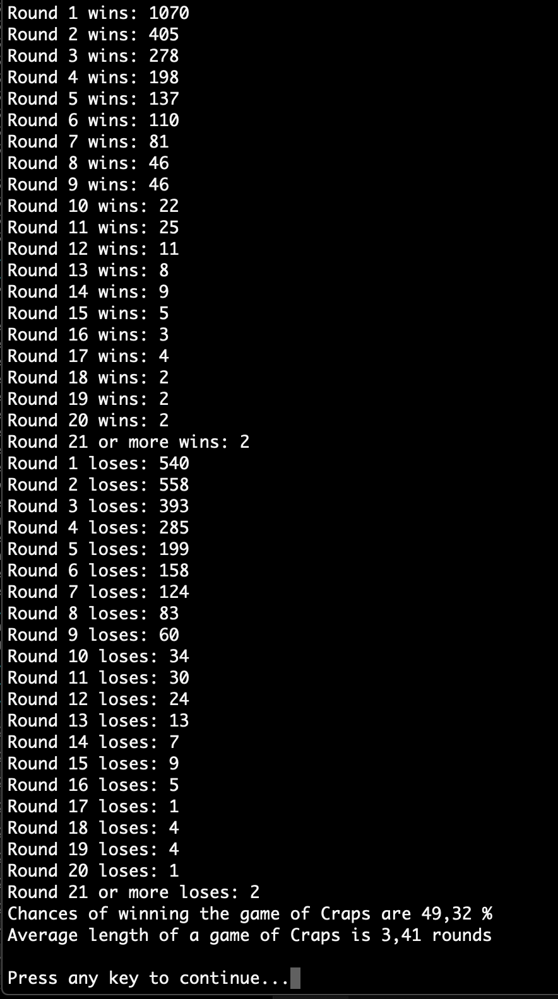
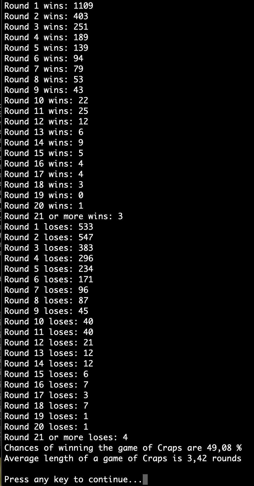

# Game of Craps

## Instructions
This is a dice game for the Console.

Open the program in Visual Studio and click play.

Rolling 2 dice, and calculating the sum.

Sum = 7, 11:              you win if it was on the first roll
Sum = 2, 3, 12:           you lose if it was on the first roll
Sum = 4, 5, 6, 8, 9, 10:  sum becomes Point.
      - To win you must continue rolling the dice until you make the same point (rolling same sum again)
      - You lose by rolling 7 before making the same point

There are a few special names that are applied for the first roll:
Sum = 2:  Snake eyes
Sum = 3:  Trey
Sum = 7:  Seven
Sum = 11: Yo leven
Sum 12:   Box cars  

The game is set to run 5000 times and showing the statistics for how many rounds it took to either win or lose. At the end it also calculates the chance of winning the game over these 5000 games and the average number of rolles it takes.

In order to display the rolls of each game, uncomment the 3 lines (108, 115, 120) in the CrapsGame class. Also decrease the number of games to a reasonable amount on line 31.

## Screenshots
Here are two example screenshots with the result of the game

## Built with
The project is built in Visual Studio, as a .NET Console Project, with C# as programming language

## Author
* Albert Stjärne (https://github.com/AlbertStjarne)
